# pytamp

  

Python Interface for the robot task and motion planning(TAMP) library

*We will commit the code soon.*

## Features

- Pure python library
- Support only kinematic world, so not consider dynamics in this repo
- Support simple motion planning (RRT*, Cartesian planning)
- Render Robot mesh using matplotlib or trimesh.Scene
- Support 4 benchmarks for tamp
- Support Robot TAMP with MCTS [Ours]

## Installation

### Requirements

You need [pygraphviz](https://github.com/pygraphviz/pygraphviz) and python3-tk package to see a MCTS tree.

- On Ubuntu 18.04 or 20.04, Download graphviz and graphviz-dev and python3-tk using  `apt`

  `sudo apt install graphviz graphviz-dev python3-tk`

- On Mac, Download graphviz using `brew`

  `brew install graphviz`

### Install pytamp

~~~
pip install pytamp
~~~

## SceneManager

- **Scene** 

  You can manage entire scene using SceneManager class. We recommend using the SceneManager.  
  For example, You can manage robot, object, gripper pose or collision as well as visualize their geom.   
  In addition, You can compute cartesian or RRT-star motion planning.  
  You can see various examples in `examples/scene` directory. 

  - Render using trimesh.Scene

    |                           baxter                           |                           sawyer                           |                           iiwa14                           |
    | :--------------------------------------------------------: | :--------------------------------------------------------: | :--------------------------------------------------------: |
    | 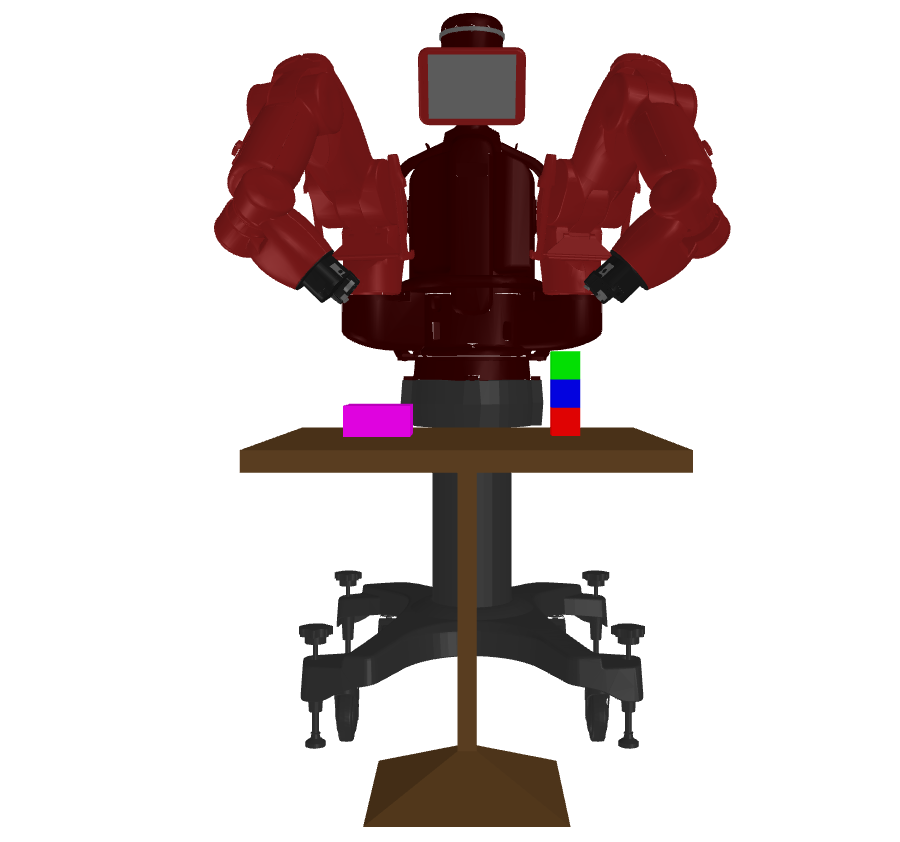 | 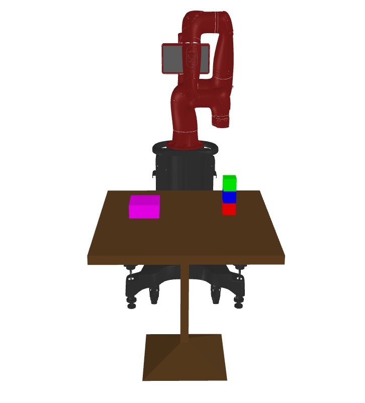 | 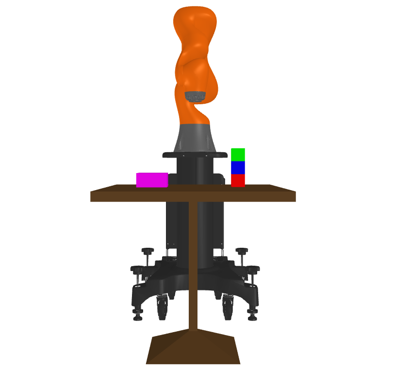 |

    |                           Panda                           |                           Doosan                           |                           UR5e                           |
    | :-------------------------------------------------------: | :--------------------------------------------------------: | :------------------------------------------------------: |
    | 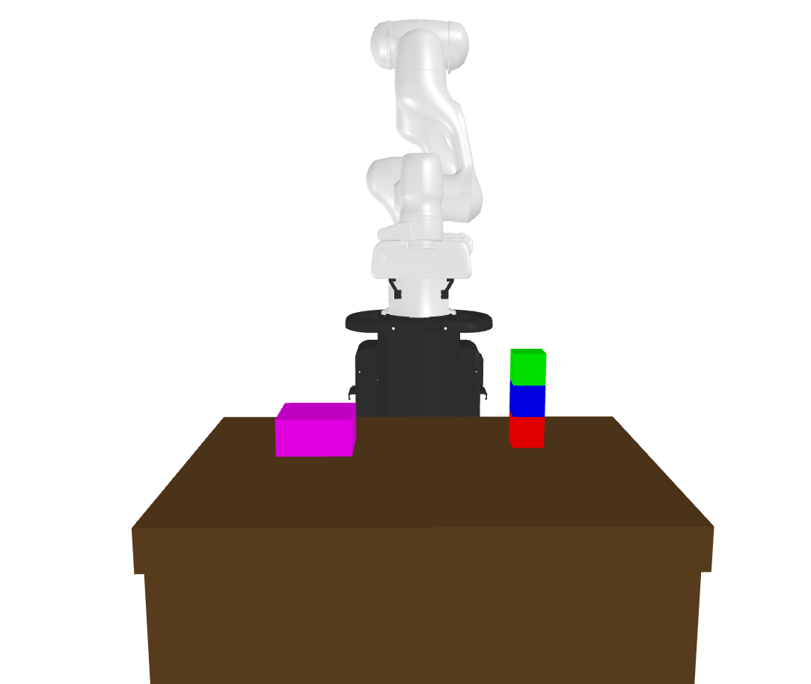 | 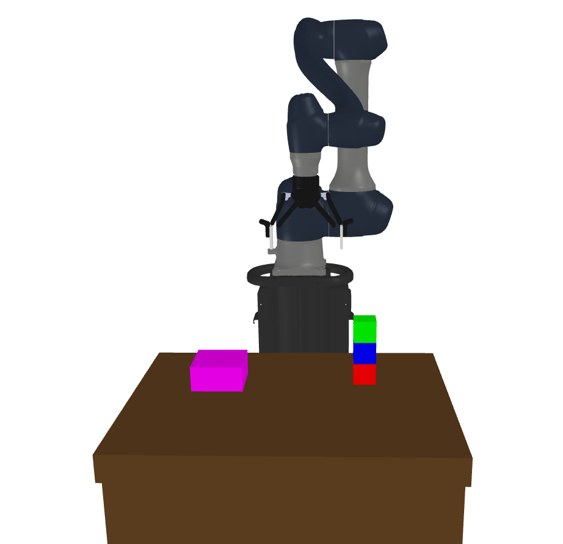 | 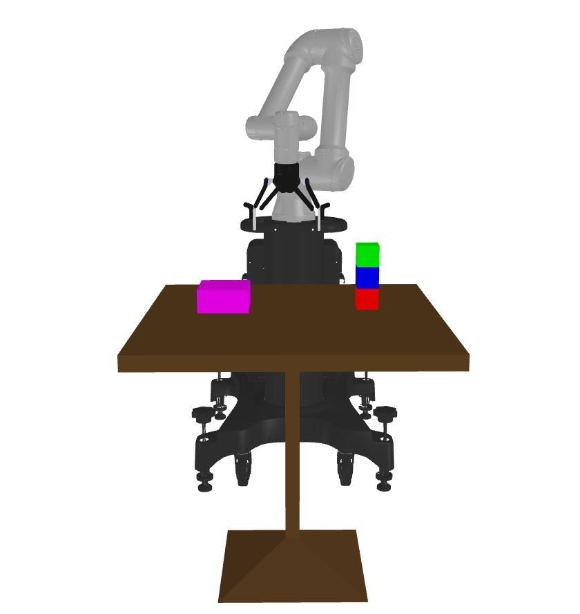 |
  
- **Planning**

  You can see an animation of planning that visualizes trajectory in `examples/planning` directory. 

  |                        Cartesian (X1)                        |                       RRT-star (X1)                        |
  | :----------------------------------------------------------: | :--------------------------------------------------------: |
  | 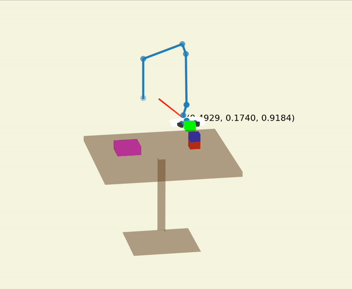 | 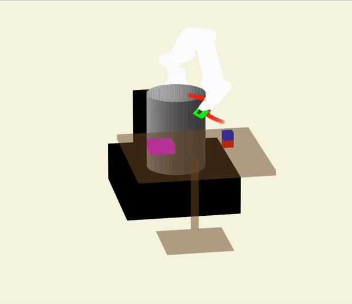 |

## Benchmark

You can use the 4 benchmarks.

|                        Benchmark1                        |                        Benchmark2                        |                        Benchmark3                        |                        Benchmark4                        |
| :------------------------------------------------------: | :------------------------------------------------------: | :------------------------------------------------------: | :------------------------------------------------------: |
| 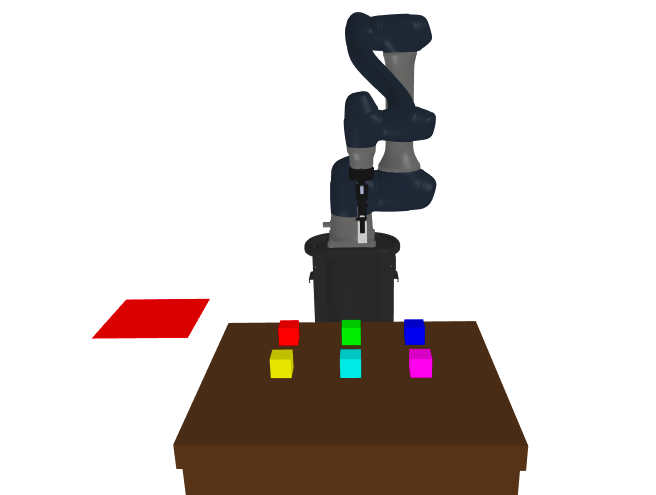 | 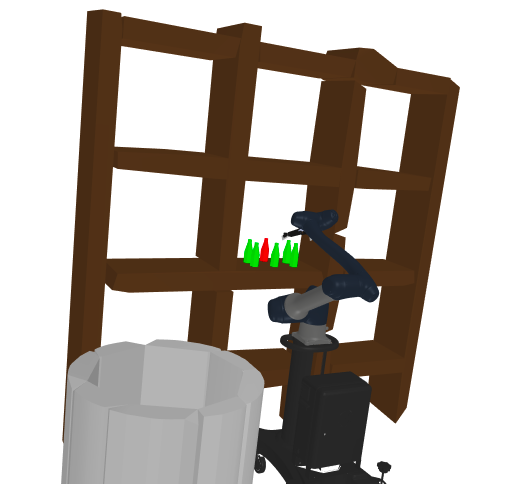 | 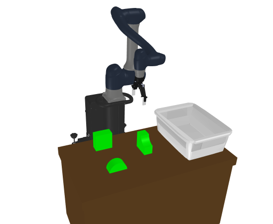 | 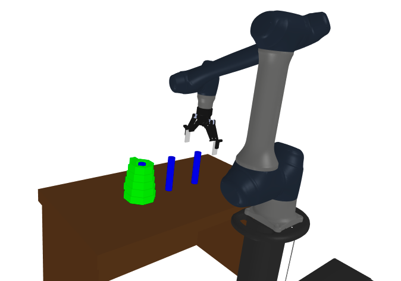 |

