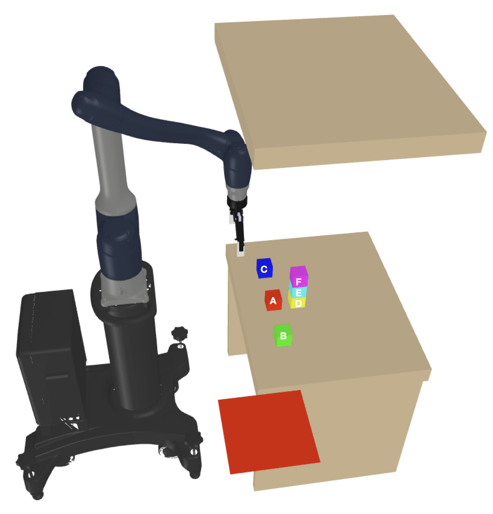
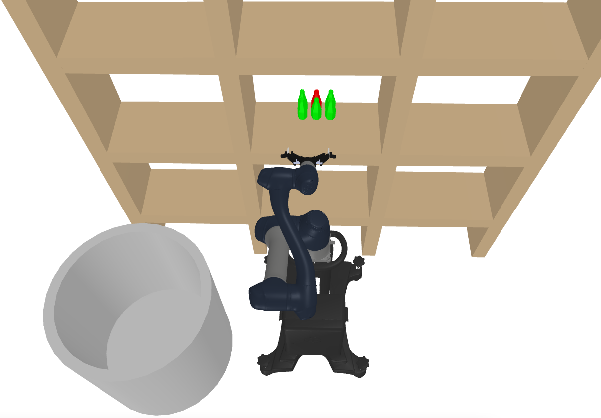
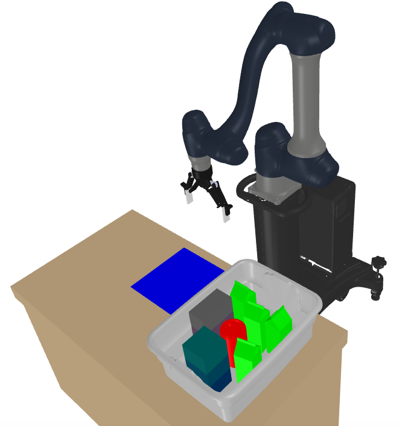
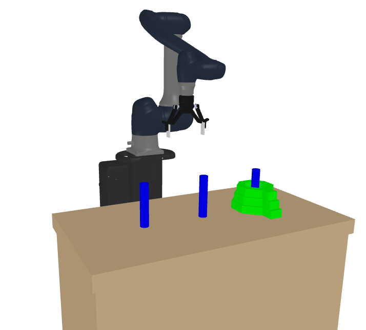
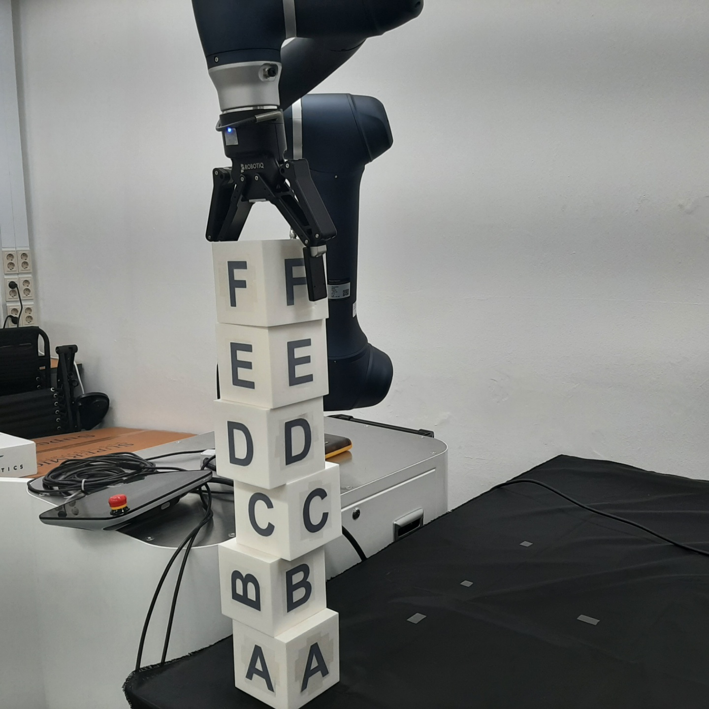
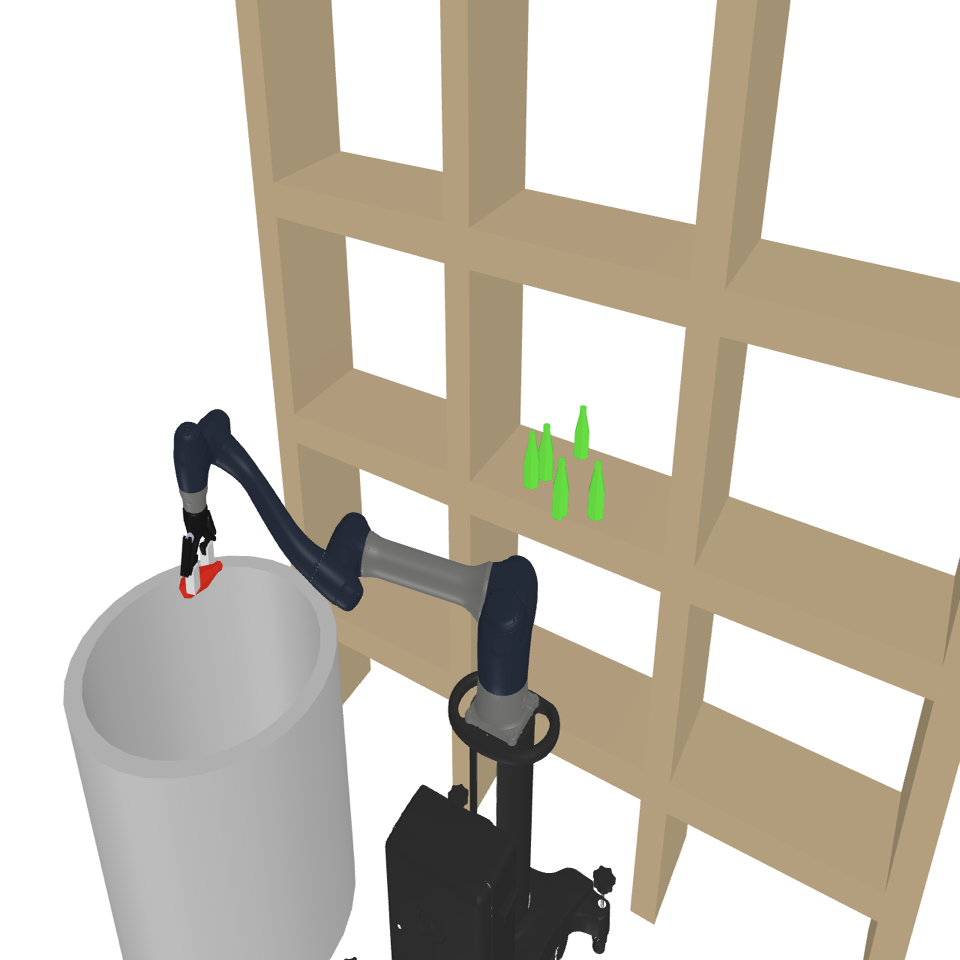
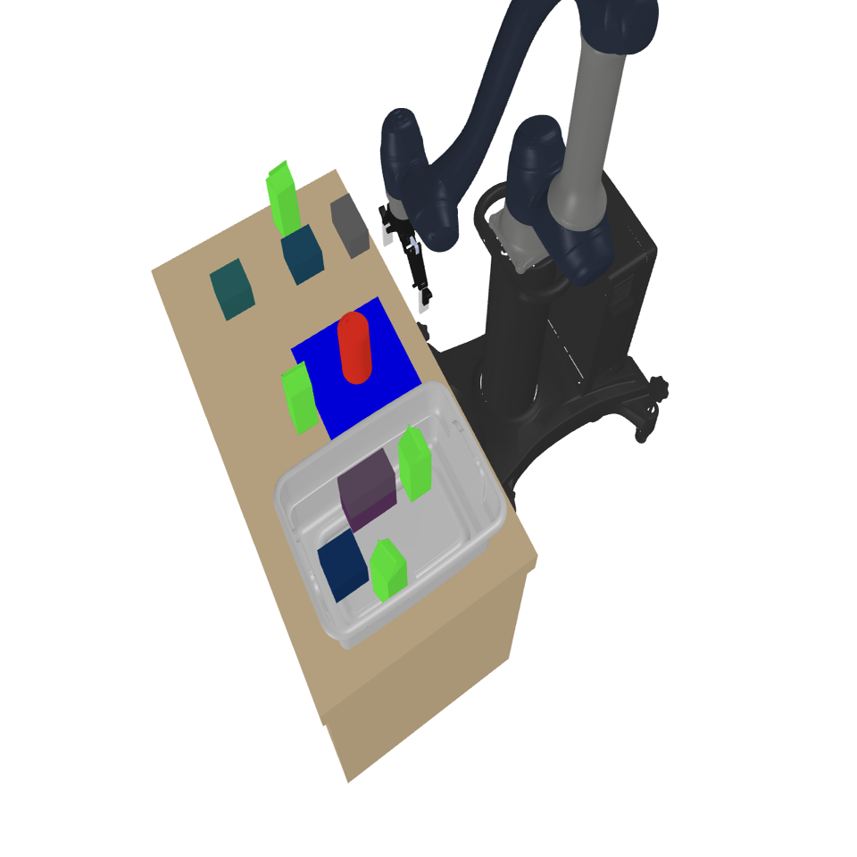
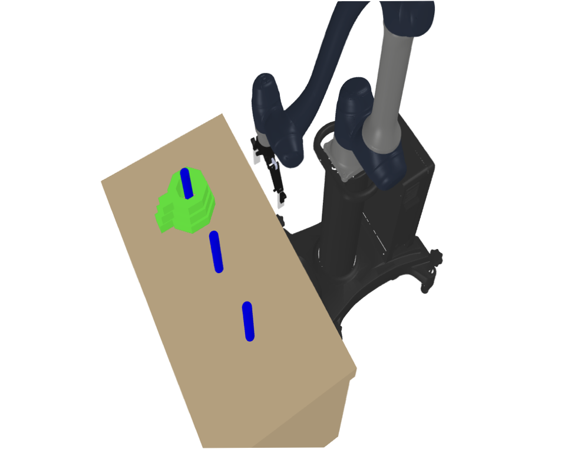

# pytamp

  

*Our paper named "Perturbation-Based Best Arm Identification for Efficient Task Planning with Monte-Carlo Tree Search", accepted to ICRA 2023.*

Python Interface for the robot task and motion planning(TAMP) library.
In the future, we are going to update it so that it can be operated in mujoco simulator.
We want to provide an environment for applying reinforcement learning in the robot domain.

## Features

- Pure python library
- Support only kinematic world, so not consider dynamics in this repo
- Support simple motion planning (RRT* , PRM* , Cartesian planning)
- Render scene using matplotlib or trimesh.Scene
- Support Robot Task and Motion Planning examples with MCTS in 4 benchmarks

## Installation

### Requirements

You need [pygraphviz](https://github.com/pygraphviz/pygraphviz) and python3-tk package to see a MCTS Tree.

- On Ubuntu 18.04 or 20.04, Download graphviz and graphviz-dev and python3-tk using  `apt`

  `sudo apt install graphviz graphviz-dev python3-tk`

- On Mac, Download graphviz using `brew`

  `brew install graphviz`

### Install pytamp

~~~
pip install pytamp
~~~

## Usage

~~~shell
# Benchmark 1 with MCTS
$ sh scripts/run_benchmark1.sh
# Benchmark 2 with MCTS
$ sh scripts/run_benchmark2.sh
# Benchmark 3 with MCTS
$ sh scripts/run_benchmark3.sh
# Benchmark 4 with MCTS
$ sh scripts/run_benchmark4.sh
~~~

If you want to see the result of the output,  Run the benchmark#_result_level_2.ipynb file for that benchmark in the **results** directory.

### Benchmark

We provide 4 benchmarks.

We also show the results when using our algorithm.

|                          Benchmark1                          |                          Benchmark2                          |                          Benchmark3                          |                          Benchmark4                          |
| :----------------------------------------------------------: | :----------------------------------------------------------: | :----------------------------------------------------------: | :----------------------------------------------------------: |
|  |  |  |  |
|                                                              |                                                              |                                                              |                                                              |
|  |  |  |  |

