# Pytamp

  

Python Interface for the Robot Task and Motion Planning(TAMP) Library

*We will commit the code soon.*

## Features

- Pure python library
- Support only URDF file
- Support only kinematic world, so not consider dynamics in this repo
- Compute Robot's kinematics (Ex. forward kinematics, inverse kinematics, Jacobian)
- Possible collision check about robot self-collision and collision between robot and objects
- Support simple motion planning (RRT*, Cartesian planning)
- Render Robot mesh using matplotlib or trimesh.Scene
- Support Robot TAMP with MCTS (Ours)

## Installation

### Requirements

You need a [python-fcl](https://github.com/BerkeleyAutomation/python-fcl) package for checking mesh collision.

- On Ubuntu, Download liboctomap-dev, libfcl-dev using  `apt`

  `sudo apt install liboctomap-dev`

  `sudo apt install libfcl-dev`
- On Mac, Download the source and build it.

  - octomap

    ~~~shell
    $ git clone https://github.com/OctoMap/octomap.git
    $ cd octomap
    $ mkdir build
    $ cd build
    $ cmake ..
    $ sudo make
    $ sudo make install
    ~~~
  - fcl
  
    Since python-fcl used version 0.5.0 of fcl, checkout with tag 0.5.0
  
    ~~~shell
    $ git clone https://github.com/flexible-collision-library/fcl.git
    $ cd fcl
    $ git checkout 0.5.0
    $ mkdir build
    $ cd build
    $ cmake ..
    $ sudo make
    $ sudo make install
    ~~~

### Install pytamp

~~~
pip install pytamp
~~~

When you clone this repository, be sure to use the **--recurse-submodules** option.
The download may take a long time because of the large urdf file size.

~~~
git clone --recurse-submodules https://github.com/jdj2261/pytamp.git
~~~

If you haven't followed the example above, Enter the command below directly.

~~~
$ git clone https://github.com/jdj2261/pytamp.git
$ cd pytamp
$ git submodule init
$ git submodule update
~~~

## Quick Start

You can see various examples (info,)

- Robot Info

  You can see 6 robot info.

  `baxter, sawyer, iiwa14, iiwa7, panda, ur5e`

  ~~~shell
  $ cd example/single_stage
  $ python robot_info.py $(robot_name)
  # baxter
  $ python robot_info.py baxter
  # saywer
  $ python robot_info.py sawyer
  ~~~

- Forward kinematics

  You can compute the forward kinematics as well as visualize the visual or collision geometry.

  ~~~shell
  $ cd example/single_stage/forward_kinematics
  $ python robot_fk_baxter_test.py
  ~~~

  |                            visual                            |                          collision                           |
  | :----------------------------------------------------------: | :----------------------------------------------------------: |
  | 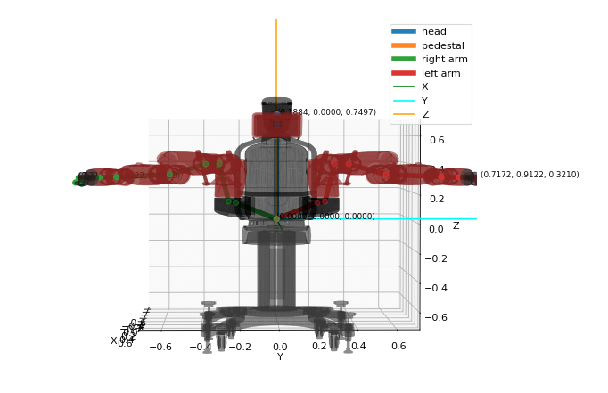 | 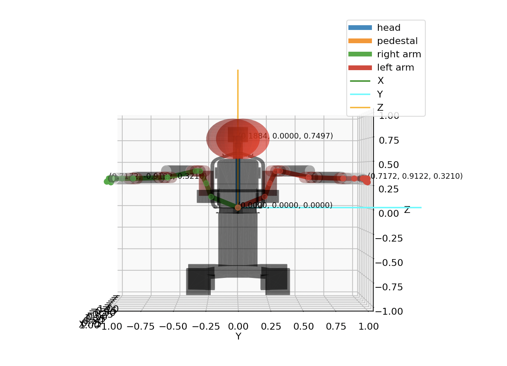 |

- Inverse Kinematics

  You can compute the inverse kinematics using levenberg marquardt(LM) or newton raphson(NR) method

  ~~~shell
  $ cd example/single_stage/inverse_kinematics
  $ python robot_ik_baxter_test.py
  ~~~

- Collision check

  The image below shows the collision result as well as visualize robot using trimesh.Scene class

  ~~~shell
  $ cd example/single_stage/collision
  $ python sawyer_collision_test.py
  ~~~

  |                        trimesh.Scene                         |                            Result                            |
  | :----------------------------------------------------------: | :----------------------------------------------------------: |
  | 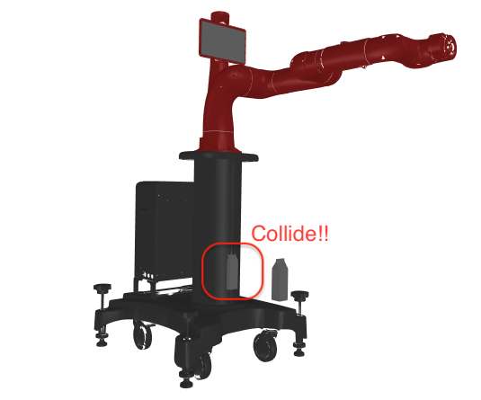 | 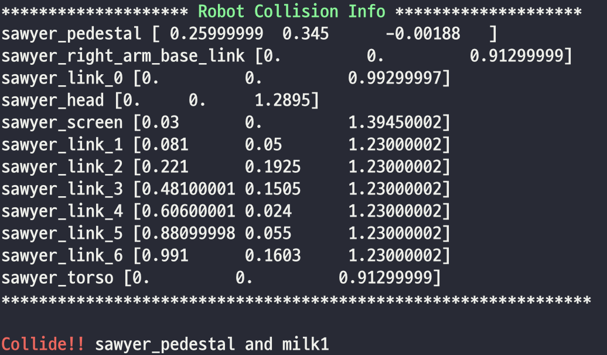 |

## Visualization

You can see visualization using matplotlib library or trimesh.Scene class.

- Visualize `simple urdf` using `matplotlib`

  |                        ur5e                        |                        sawyer                        |                        iiwa14                        |                        panda                        |
  | :------------------------------------------------: | :--------------------------------------------------: | :--------------------------------------------------: | :-------------------------------------------------: |
  | 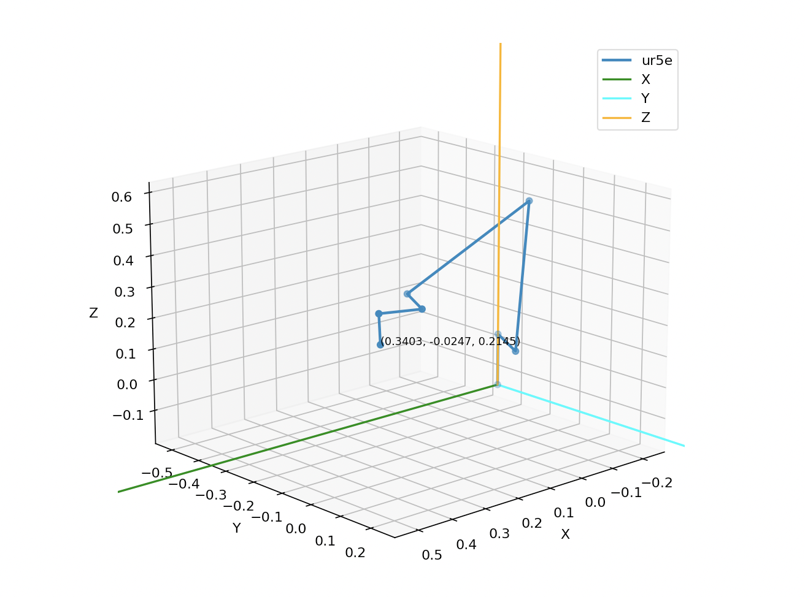 | 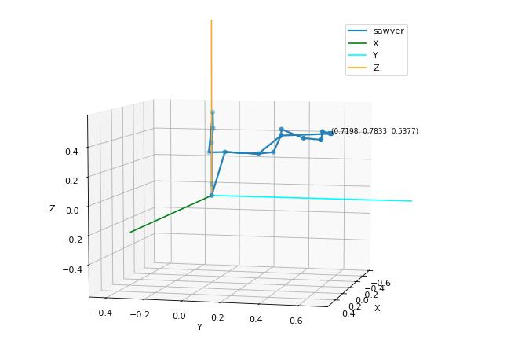 | 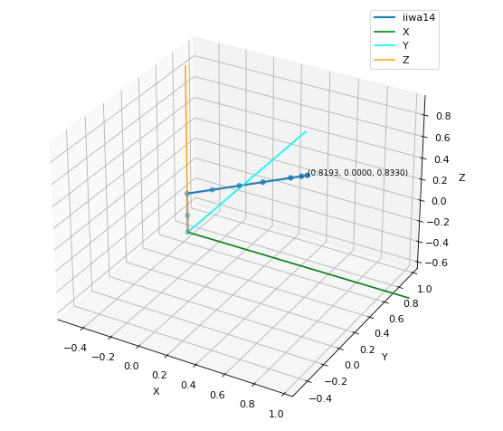 | 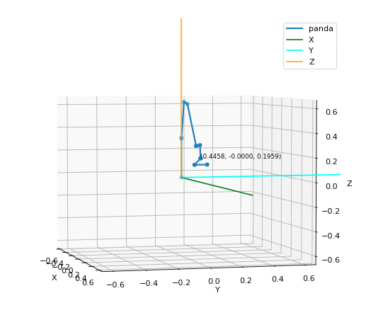 |

- Visualize `visual geometry` using `matplotlib`

  |                           ur5e                            |                           sawyer                            |                           iiwa14                            |                           panda                            |
  | :-------------------------------------------------------: | :---------------------------------------------------------: | :---------------------------------------------------------: | :--------------------------------------------------------: |
  | 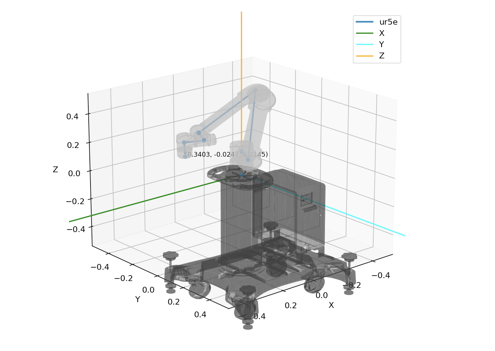 | 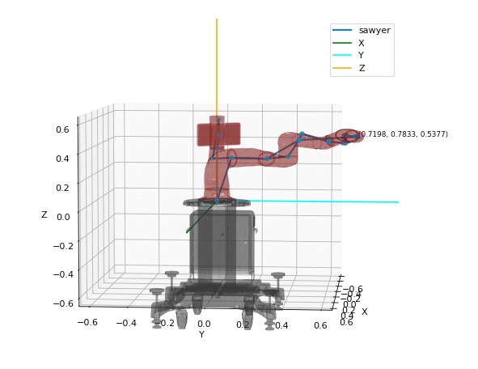 | 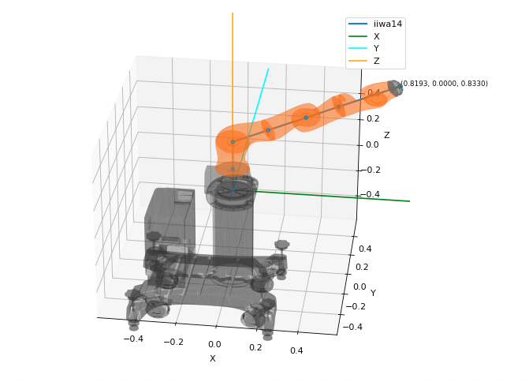 | 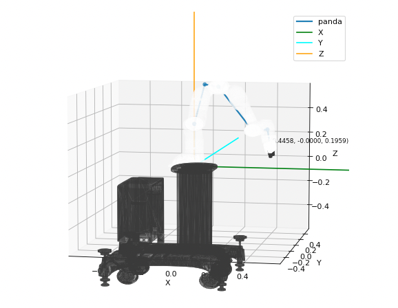 |

- Visualize `collision geometry` using `matplotlib`

  |                             ur5e                             |                            sawyer                            |                            iiwa14                            |                            panda                             |
  | :----------------------------------------------------------: | :----------------------------------------------------------: | :----------------------------------------------------------: | :----------------------------------------------------------: |
  | 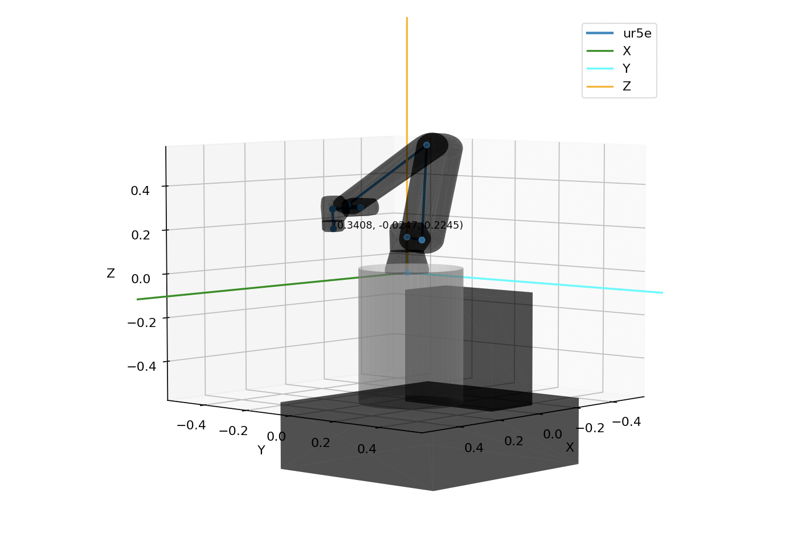 | 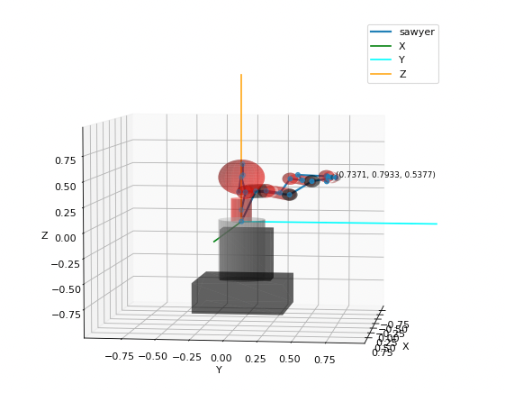 | 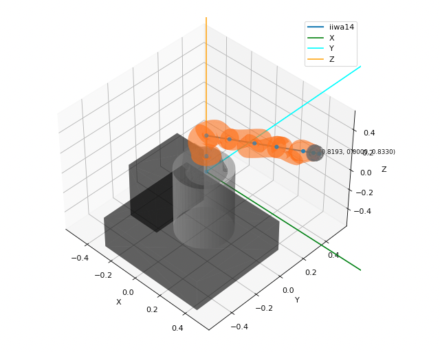 | 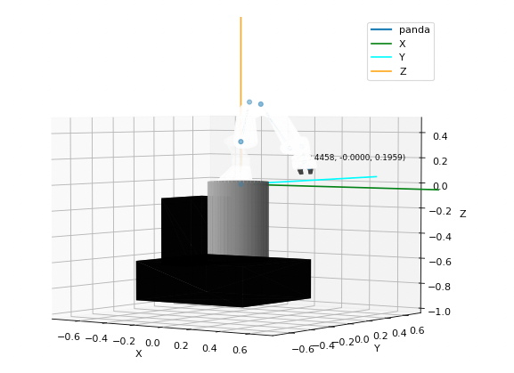 |

- Visualize mesh about `visual/collision geometry` using `trimesh.Scene class`

  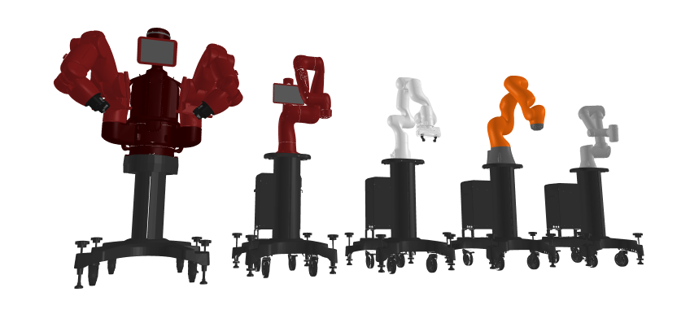

## SceneManager

- **Scene** 

  You can manage entire scene using SceneManager class. We recommend using the SceneManager.  
  For example, You can manage robot, object, gripper pose or collision as well as visualize their geom.   
  In addition, You can compute cartesian or motion planning.  
  You can see various examples in `example/scene` directory. 

  - Render using trimesh.Scene

    |                           baxter                           |                           sawyer                           |                           iiwa14                           |
    | :--------------------------------------------------------: | :--------------------------------------------------------: | :--------------------------------------------------------: |
    |  |  |  |

  - Render using matplotlib

    |                            baxter                            |                            sawyer                            |                            iiwa14                            |
    | :----------------------------------------------------------: | :----------------------------------------------------------: | :----------------------------------------------------------: |
    |  |  |  |

- **Attach object to robot**

  You can manage by attaching or detaching objects to the gripper.  
  These managing are used for Planning. You can see a example in `example/scene/gripper` directory. 

  ~~~shell
  $ cd example/scene/gripper
  $ python scene_attach_detach_test.py
  ~~~

  You can see the attaching process as shown in the figure below.  
  If the object is attached, a color of the object will change black. And then, the object becomes a part of the robot.
  
  |                       Move a robot                       |                 Attach an object to robot                  |                         Move a robot                         |                      Detach an object                      |
  | :------------------------------------------------------: | :--------------------------------------------------------: | :----------------------------------------------------------: | :--------------------------------------------------------: |
  |  |  |  |  |
  
- **Planning**

  You can see an animation that visualizes trajectory in `example/planning` directory. 

  |                          Cartesian                           |                             RRT*                             |
  | :----------------------------------------------------------: | :----------------------------------------------------------: |
  | 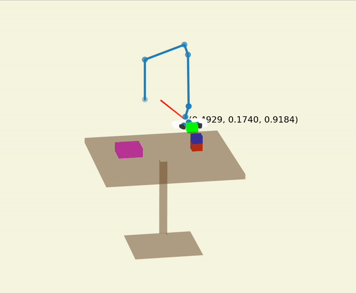 | 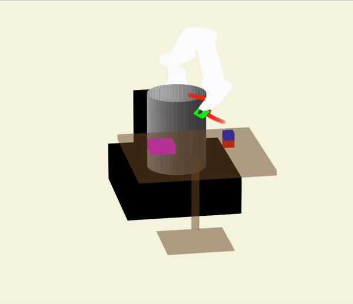 |

- **Pick and Place**

  Comming soon...
