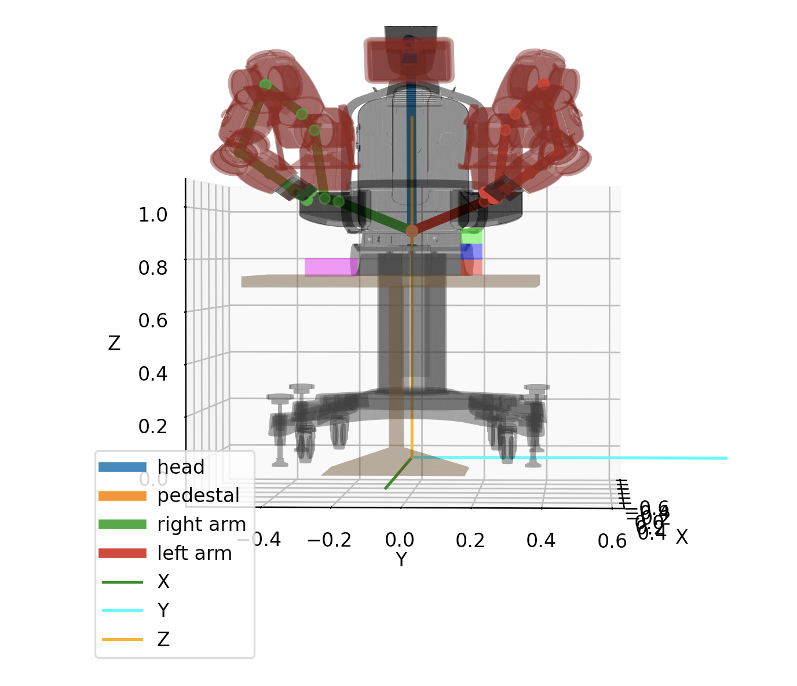
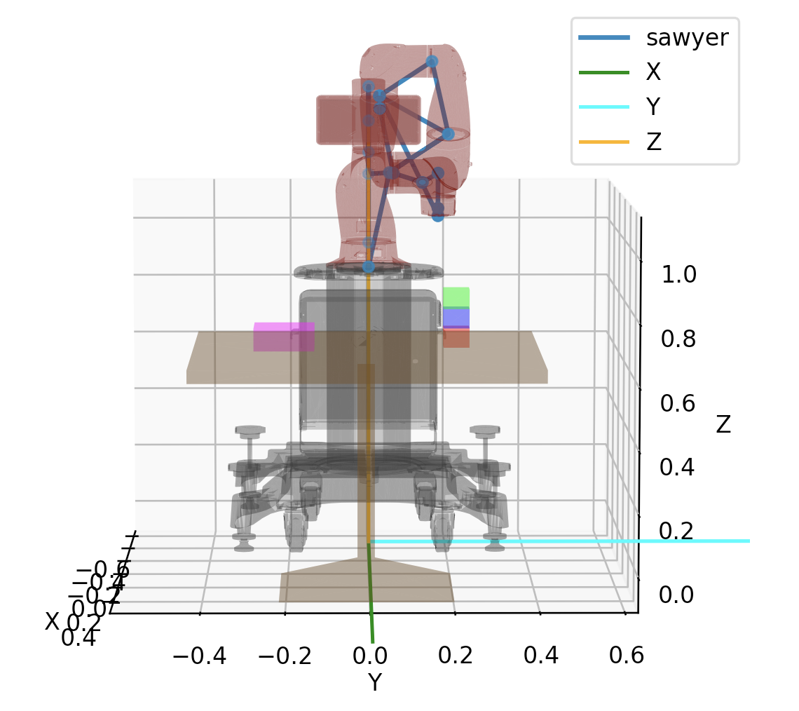
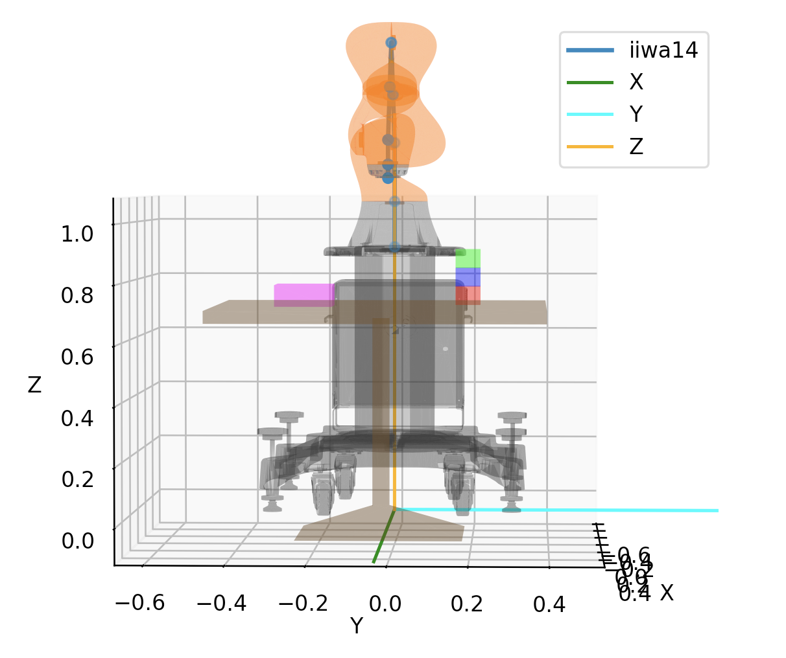
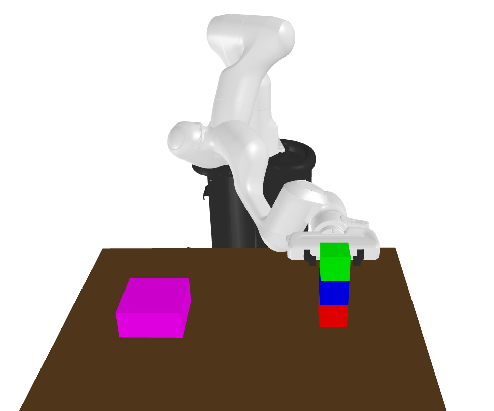
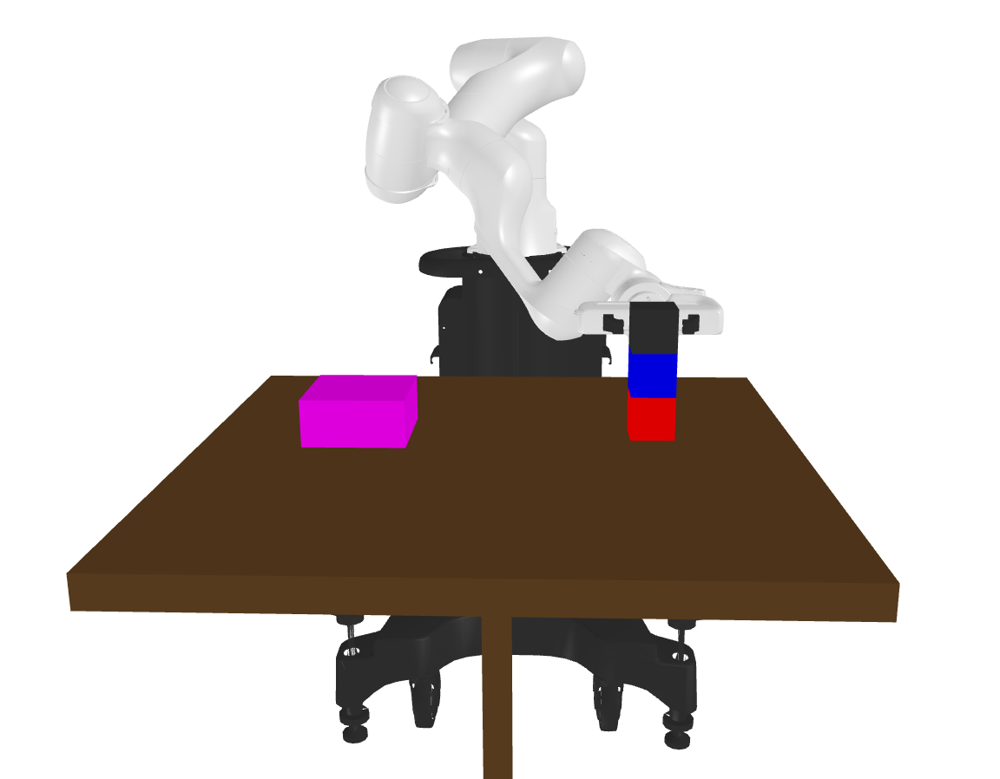
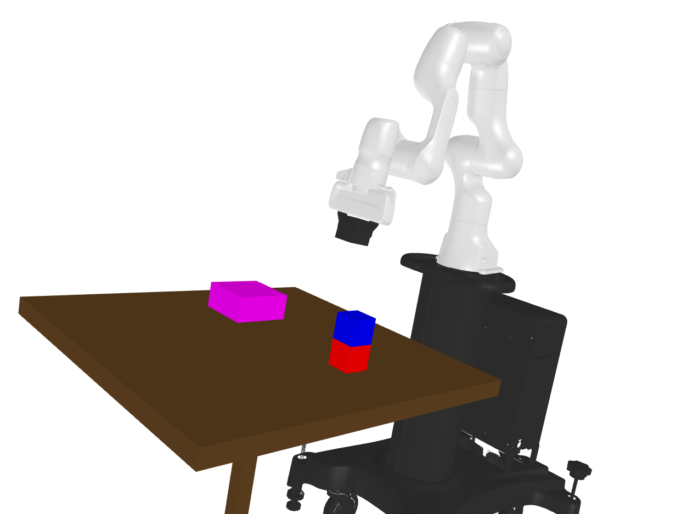
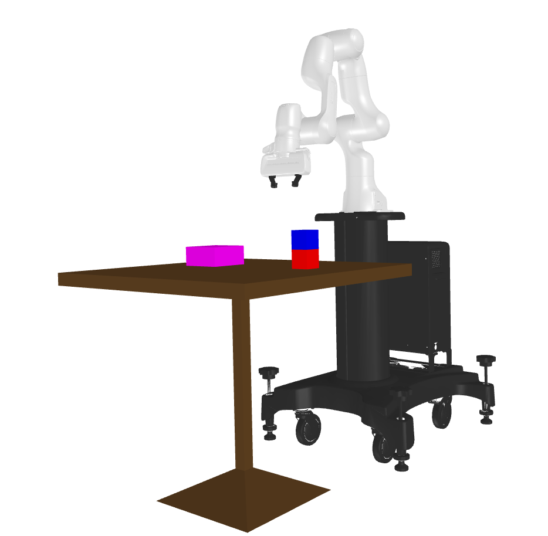
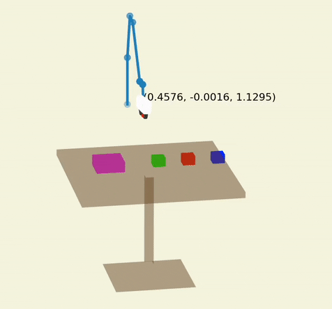
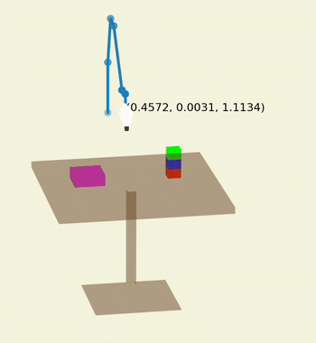

# pytamp

  

Python Interface for the robot task and motion planning(TAMP) library

*We will commit the code soon.*

## Features

- Pure python library
- Support only URDF file
- Support only kinematic world, so not consider dynamics in this repo
- Compute robot's kinematics (Ex. forward kinematics, inverse kinematics, Jacobian)
- Enable to check collision about robot self-collision and collision between robot and objects
- Support simple motion planning (RRT*, Cartesian planning)
- Render Robot mesh using matplotlib or trimesh.Scene
- Support Robot TAMP with MCTS [Ours]

## Installation

### Requirements

You need [pygraphviz](https://github.com/pygraphviz/pygraphviz) and python3-tk package to see a MCTS tree.

- On Ubuntu 18.04 or 20.04, Download graphviz and graphviz-dev and python3-tk using  `apt`

  `sudo apt install graphviz graphviz-dev python3-tk`

- On Mac, Download graphviz using `brew`

  `brew install graphviz`

### Install pytamp

~~~
pip install pytamp
~~~

## SceneManager

- **Scene** 

  You can manage entire scene using SceneManager class. We recommend using the SceneManager.  
  For example, You can manage robot, object, gripper pose or collision as well as visualize their geom.   
  In addition, You can compute cartesian or motion planning.  
  You can see various examples in `example/scene` directory. 

  - Render using trimesh.Scene

    |                           baxter                           |                           sawyer                           |                           iiwa14                           |
    | :--------------------------------------------------------: | :--------------------------------------------------------: | :--------------------------------------------------------: |
    |  |  |  |

  - Render using matplotlib

    |                            baxter                            |                            sawyer                            |                            iiwa14                            |
    | :----------------------------------------------------------: | :----------------------------------------------------------: | :----------------------------------------------------------: |
    |  |  |  |

- **Attach object to robot**

  You can manage by attaching or detaching objects to the gripper.  
  These method will be used for motion planning. You can see a example in `example/scene/gripper` directory. 

  ~~~shell
  $ cd example/scene/gripper
  $ python scene_attach_detach_test.py
  ~~~

  You can see the attaching process as shown in the figure below.  
  If the object is attached, a color of the object will change black. And then, the object becomes a part of the robot.
  
  |                       Move a robot                       |                 Attach an object to robot                  |                         Move a robot                         |                      Detach an object                      |
  | :------------------------------------------------------: | :--------------------------------------------------------: | :----------------------------------------------------------: | :--------------------------------------------------------: |
  |  |  |  |  |
  
- **Planning**

  You can see an animation of planning that visualizes trajectory in `example/planning` directory. 

  |                        Cartesian (X1)                        |                       RRT-star (X1)                        |
  | :----------------------------------------------------------: | :--------------------------------------------------------: |
  |  |  |

- **Pick and Place**

  You can see an animation of pick and place that visualizes trajectory  in `example/action` directory.
  
  |                Scene arranged objects (X4)                 |                Scene stacked objects (X4)                 |
  | :--------------------------------------------------------: | :-------------------------------------------------------: |
  |  |  |
